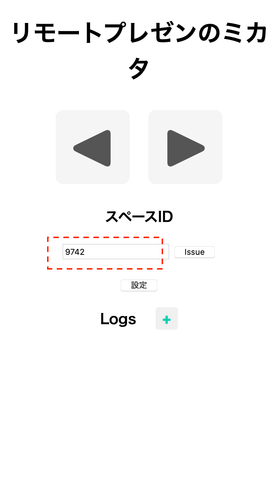

# prevNext Keyboard Emulator

「リモートプレゼンのミカタ」の、PC 側ツールです。
キーボード出力をエミュレーションして、矢印キー信号を送信することで、スライド送りを実現します。

## 実行方法

```zsh
$ prevNext 1234
```

`1234`　の部分は、スペース ID が入ります。
[Web tool](https://prevNext.yuseiito.com/)で設定されたスペース ID を入力してください。



## インストール

prevNext は Python3 で実装されています。
インストールは、`pip` 経由で行います。

```zsh
$ pip install git+https://github.com/yuseiito/prevNext-client
```
